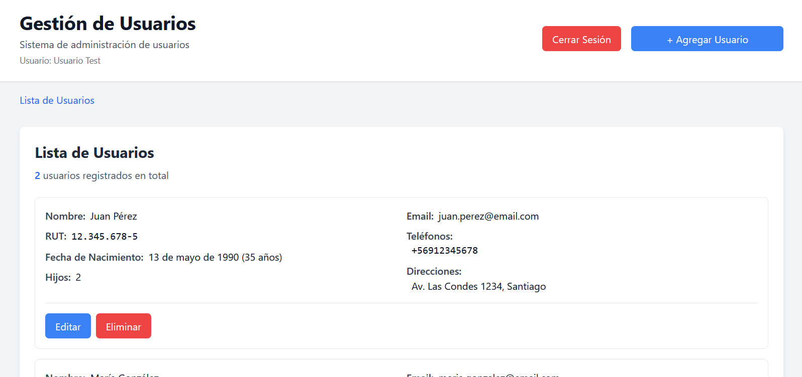

# App de Gestión de Usuarios

[](https://github.com/b0ir/user-management-app-qa/actions/workflows/ci.yml)
[](https://www.codefactor.io/repository/github/b0ir/user-management-app-qa)
[](https://codecov.io/gh/b0ir/user-management-app-qa)

Aplicación web CRUD para gestión de usuarios con enfoque en testing completo. Desarrollada en TypeScript y React, incluye testing unitario, de integración y E2E con cobertura >90%, CI/CD automatizado y análisis de seguridad.



## 🚀 Página de Prueba

**Aplicación desplegada en GitHub Pages:**
**[Ver aplicación →](https://b0ir.github.io/user-management-app-qa/)**

**Credenciales de prueba:**

- Usuario: `cualquier valor`
- Contraseña: `1234`

## ⚡ Inicio Rápido

### Prerrequisitos

- Node.js 18.x o superior
- npm 9.x o superior

```bash
# Clonar repositorio
git clone https://github.com/b0ir/user-management-app-qa.git
cd user-management-app-qa

# Instalar dependencias
npm install

# Ejecutar en desarrollo
npm run dev

# Ejecutar en producción
npm run build
npm run preview
```

La aplicación estará disponible en `http://localhost:3000` (desarrollo) o `http://localhost:4173` (producción).

## 🧪 Comandos de Testing

```bash
# Tests unitarios y de integración
npm run test

# Tests con reporte de coverage
npm run test:coverage

# Tests E2E con Playwright
npm run test:e2e

# Linting
npm run lint
```

## 🏗️ Funcionalidades Implementadas

- **CRUD completo** de usuarios con validación en tiempo real
- **RUT único** con algoritmo de validación chileno
- **Campos múltiples** para teléfonos y direcciones
- **Restricción de eliminación** en cumpleaños
- **API REST simulada** completa
- **Autenticación simulada** con manejo de sesión
- **CI/CD con GitHub Actions** para testing automático, deployment y análisis de seguridad con Snyk
- **Tests E2E** con Playwright
- **Cobertura de código** con Codecov

## 📁 Arquitectura

```
src/
├── __tests__/            # Tests organizados por tipo
│   ├── integration/      # Tests de API y flujos completos
│   └── unit/             # Tests unitarios (context, components, utils)
├── components/           # Componentes React modulares
│   ├── UserForm/         # Formulario con hooks, utils y subcomponentes
│   ├── UserList/         # Lista con subcomponentes especializados
│   └── LoginForm.tsx     # Autenticación
├── context/              # React Context para sesión
├── services/             # API REST simulada con UserService
├── types/                # Interfaces TypeScript (User, DTOs, ApiResponse)
├── utils/                # Validaciones (RUT, email, teléfono)
└── App.tsx               # Routing y estado global
e2e/                      # Tests End-to-End con Playwright
.github/workflows/        # CI/CD y análisis de seguridad
```

## 🔧 Decisiones Técnicas

**Frontend:**

- **React + TypeScript** para desarrollo type-safe con componentes reutilizables
- **Tailwind CSS** para estilos responsive y consistentes
- **Vite** para compilación rápida y mejor experiencia de desarrollo

**Testing:**

- **Jest** para tests unitarios e integración con cobertura de código
- **Playwright** para tests E2E cross-browser, elegido por su versatilidad y creciente adopción en la industria
- **CI/CD testing** automatizado en cada push y pull request

**Validaciones:**

- **Algoritmo de RUT chileno** con dígito verificador para validación local
- **Validación de formularios** en tiempo real con feedback inmediato
- **Formateo automático** de campos de entrada

**UX/UI:**

- **Diseño responsive** para móviles (320px+), tablets (768px+) y desktop (1024px+)
- **Estados visuales** para loading, error y validación
- **Navegación accesible** por teclado y screen readers

## 📊 Cobertura de Testing

- **Tests unitarios:** Validaciones (RUT, email), hooks personalizados y utilidades
- **Tests de integración:** API, flujos de formularios y interacciones entre componentes
- **Tests E2E:** Casos de uso críticos (CRUD completo, autenticación, validaciones)
- **Cobertura:** >90% en funciones y líneas críticas con reporte automatizado
- **Testing cross-browser:** Chrome, Firefox, Safari, Mobile Chrome y Mobile Safari en tests E2E
