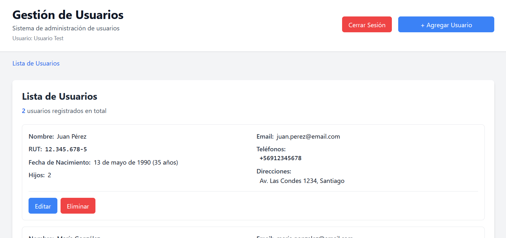

# User Management App

[](https://github.com/b0ir/user-management-app-qa/actions/workflows/ci.yml)
[](https://www.codefactor.io/repository/github/b0ir/user-management-app-qa)
[](https://codecov.io/gh/b0ir/user-management-app-qa)

A CRUD user management app built with React and TypeScript, focused on comprehensive testing — unit, integration, and E2E with >90% coverage.



## Live Demo

**[https://b0ir.github.io/user-management-app-qa/](https://b0ir.github.io/user-management-app-qa/)**

Login with any username and password `1234`.

> **Note:** Data is stored in memory and resets on page refresh. This is intentional — the app is a QA testing target, not a production backend.

## Tech Stack

| Layer | Tool |
|---|---|
| UI | React 18, TypeScript |
| Styling | Tailwind CSS |
| Build | Vite |
| Unit / Integration | Jest |
| E2E | Playwright |
| CI/CD | GitHub Actions |
| Coverage | Codecov |

## Getting Started

**Requirements:** Node.js 18+ and npm 9+

```bash
git clone https://github.com/b0ir/user-management-app-qa.git
cd user-management-app-qa
npm install
npm run dev
```

App runs at `http://localhost:3000`.

## Scripts

| Command | Description |
|---|---|
| `npm run dev` | Start dev server |
| `npm run build` | Type-check and build for production |
| `npm run preview` | Preview production build locally |
| `npm run lint` | Lint with zero warnings allowed |
| `npm run lint:fix` | Auto-fix lint issues |
| `npm run type-check` | TypeScript type check only |
| `npm run format` | Format with Prettier |
| `npm run test` | Run unit + integration tests |
| `npm run test:watch` | Run tests in watch mode |
| `npm run test:coverage` | Run tests with coverage report |
| `npm run test:e2e` | Run Playwright E2E tests |
| `npm run test:e2e:ui` | Open Playwright UI mode |
| `npm run test:e2e:debug` | Run Playwright in debug mode |

## Features

- Full CRUD with real-time form validation
- Chilean RUT validation (check-digit algorithm)
- Multiple phones and addresses per user
- Deletion blocked on user's birthday
- Simulated REST API with in-memory state
- Simulated auth with session management

## Project Structure

```
src/
├── __tests__/
│   ├── integration/        # API and full-flow tests
│   └── unit/               # Context, components, utilities
├── components/
│   ├── UserForm/           # Form with hooks, utils, subcomponents
│   ├── UserList/           # List view
│   └── LoginForm.tsx
├── context/                # Auth context
├── services/               # Mock API (UserService)
├── types/                  # TypeScript interfaces (User, DTOs, ApiResponse)
├── utils/                  # RUT, email, phone validation
└── App.tsx
e2e/                        # Playwright E2E tests
.github/workflows/          # CI, CodeQL, dependency review
```

## Test Coverage

| Layer | What's tested |
|---|---|
| Unit | RUT/email/phone validation, hooks, utilities |
| Integration | API service, form flows, component interactions |
| E2E | Full CRUD, authentication, validation, edge cases |
| Browsers | Chrome, Firefox, Safari, Mobile Chrome, Mobile Safari |

